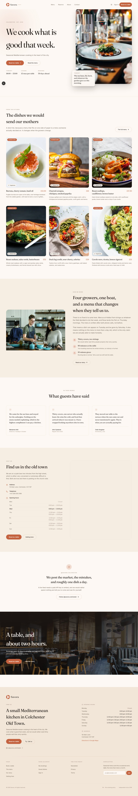

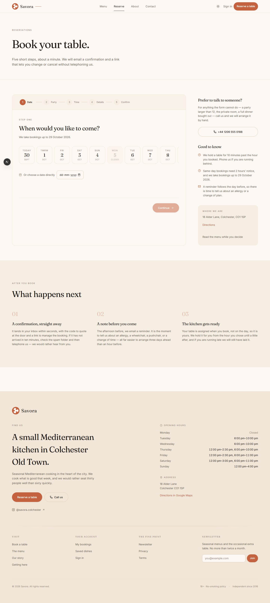
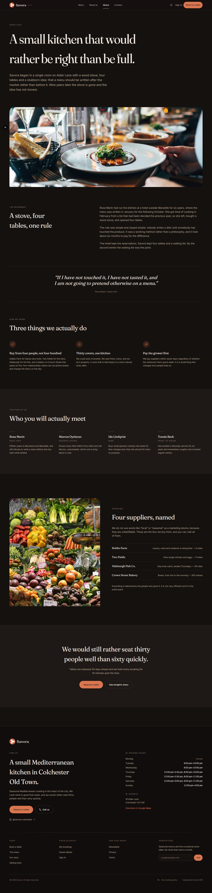
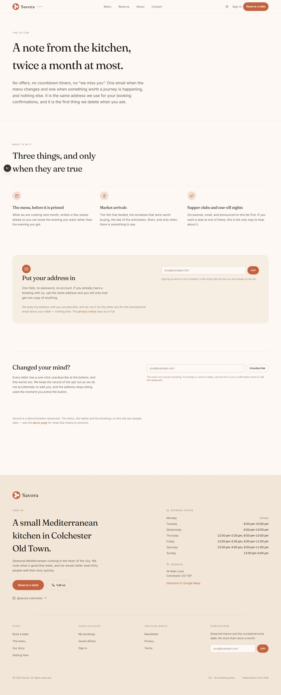
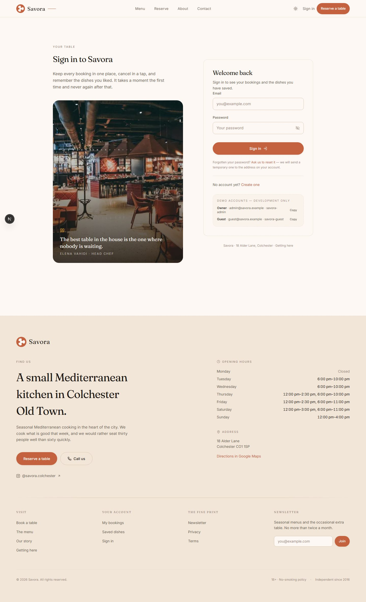

<div align="center">

# 🍽️ Savora

### Seasonal Mediterranean cooking in the heart of the city 🌿

**A beautifully crafted restaurant site with a booking engine that guarantees no double-booking.** ✨

[](https://nextjs.org)
[](https://react.dev)
[](https://www.typescriptlang.org)
[](https://www.postgresql.org)
[](https://www.prisma.io)
[](LICENSE)
[](https://vercel.com/raj-suhandanis-projects/savora)

[Live demo](#-live-demo) · [Quick start](#-quick-start) · [Screenshots](#-screenshots) · [The double-booking guarantee](#️-the-double-booking-guarantee)

</div>

---

Savora is a complete restaurant site: a menu with per-dish detail pages, a
four-step booking flow, customer accounts with favourites, a staff dashboard
covering the floor plan and every sitting, a newsletter, and a contact form —
built on Next.js 16 with a real PostgreSQL database and no paid services.

Two things make it more than a brochure:

1. **Double-booking is impossible, not unlikely.** A table cannot be sold twice
   for overlapping times, and the database itself refuses the second write. See
   [the guarantee](#the-double-booking-guarantee).
2. **You can run the whole thing with no database server at all.** The same
   migrations and the same seed run inside the process on PostgreSQL compiled to
   WebAssembly. See [demo mode](#demo-mode-no-database-server).

## 🚀 Live demo

👉 **[View Deployment on Vercel](https://vercel.com/raj-suhandanis-projects/savora)**

The deployed preview runs [demo mode](#demo-mode-no-database-server): it boots
its own PostgreSQL, applies both migrations and seeds itself on first request.
Nothing to configure, nothing to sign up for.

<!-- LIVE-DEMO-LINK -->

### Demo accounts — sign in

The seed ships two accounts so you can walk straight into both dashboards. They
work on the live demo and on a local `npm run dev` alike.

| Role | What you'll see | Email | Password |
| --- | --- | --- | --- |
| **Staff** | Floor plan, every sitting, dish & table management, customers, settings | `admin@savora.example` | `savora-admin` |
| **Customer** | Your bookings, saved favourites, profile | `guest@savora.example` | `savora-guest` |

Go to **`/signin`**, enter an email and password, and you are sent to the right
dashboard — staff to `/admin`, a customer to `/account`. `npm run check:demo`
verifies both accounts really sign in against a demo-mode server, so these
credentials are verified rather than aspirational.

## 📸 Screenshots

Every image below is a real full-page capture of the running app — no mockups.

### Home



**Home, desktop.** The hero, the seasonal menu preview, the reservation call to
action and the opening-hours panel. Scroll-triggered reveals throughout.

### The menu



**Menu, desktop.** 26 seeded dishes across starters, mains, desserts and drinks,
filterable by category, with dietary tags and live availability.

### Booking



**Booking, desktop.** Party size and date first, then live availability, then
guest details — each step validates before the next one unlocks.

### The rest of the site



**About, dark.** The story page, including the seasonal menu and the team.



**Newsletter.** Real signup with server-side validation, a honeypot and a
per-IP rate limit — the address is stored, not emailed anywhere.

**Contact, phone.**



**Sign in.** Auth.js with credentials — use the
[demo accounts](#demo-accounts--sign-in) above. Plus an optional Google button
that hides itself when no client id is configured.

## 📦 What is in the box

| | |
| --- | --- |
| **Public site** | Home, menu with category filters, per-dish pages, about, contact, newsletter, privacy, terms |
| **Booking** | Four-step flow, live slot availability, party-size-aware table assignment, confirmation code, self-service manage link |
| **Accounts** | Register, sign in, favourites, profile — Auth.js with a Prisma session store |
| **Staff dashboard** | Floor plan, every sitting with status, dish availability, customer list, settings |
| **Reminders** | Cron-driven confirmation and reminder emails, plus automatic no-show reconciliation |
| **Email** | Rendered HTML templates, delivered via Resend or SMTP, or written to `.outbox/` for reading locally |
| **Security** | Per-IP rate limits, honeypots, constant-time cron secret comparison, bcrypt password hashing, re-authorised admin actions |

## 🛡️ The double-booking guarantee

Most booking systems treat a double-booking as a bug to be retried. This one
makes it unrepresentable.

`Reservation.slot` is a generated range column, and a GiST exclusion constraint
refuses any two active reservations that share a table and overlap in time:

```sql
ALTER TABLE "Reservation"
  ADD COLUMN "slot" tstzrange
    GENERATED ALWAYS AS (tstamptzrange("startsAt", "endsAt", '[)')) STORED;

ALTER TABLE "Reservation"
  ADD CONSTRAINT "Reservation_no_overlapping_slot_per_table"
  EXCLUDE USING gist ("tableId" WITH =, "slot" WITH &&)
  WHERE ("status" IN ('PENDING', 'CONFIRMED', 'SEATED'));
```

Because the constraint lives in the database, it holds no matter which code path
writes a row — the booking form, a dashboard action, a script, or a future
endpoint nobody remembered to guard.

Three details in that snippet are load-bearing:

- **`GENERATED ALWAYS`.** The range is owned by PostgreSQL, so it cannot drift
  out of step with the two timestamps it is derived from. Application code never
  computes it.
- **`WHERE status IN (...)`.** `CANCELLED` and `NO_SHOW` are excluded on
  purpose. The reconciliation job writes `NO_SHOW` in bulk, so including that
  status would leave every table that ever had a no-show permanently
  unbookable.
- **`tstzrange`, not `tsrange`.** A range over timestamps without a zone would
  compare wall-clock times from two different offsets as though they were the
  same instant.

Above the constraint sits advisory logic in `src/lib/availability.ts` that ranks
tables and suggests alternatives. The constraint is the backstop; when it fires,
`createReservation` catches SQLSTATE `23P01` and re-reads the day to try the
next-best table.

It also retries on `40P01` (deadlock) and `40001` (serialization failure).
Five transactions inserting overlapping ranges into one GiST index occasionally
deadlock instead of one cleanly losing — the guarantee still held, but the losers
were not all reported as `23P01`, and treating only `23P01` as retryable let that
reach the guest as a raw 500. The shared predicate is `isRetryableConflict()` in
`src/lib/db.ts`.

> A note on reading the code: Prisma re-wraps driver errors, so an
> exclusion-constraint rejection arrives with `code: "P2039"` and the SQLSTATE
> buried at `meta.driverAdapterError.cause.code`. `pgErrorCode()` looks there
> first for exactly that reason.

## Demo mode: no database server

`npm run db:up` starts a real PostgreSQL 18 as a detached local process — no
Docker, no admin rights, no cloud account, no cost. That is the default path and
the one worth developing against.

But a preview deploy usually has nowhere to put a database, and a site whose menu
is empty is not a demo. So there is a second mode:

```bash
DEMO_DB=1 npm run dev
```

With `DEMO_DB=1` the app ignores `DATABASE_URL` and connects to
[PGlite](https://pglite.dev) — PostgreSQL compiled to WebAssembly — running in
the same process. It applies the same two migrations from `prisma/migrations/`
and the same seed from `prisma/seed-data.ts`. Not a mock, not a fixture loader:
the same SQL, the same schema, the same constraints, including the exclusion
constraint above.

Three things it needs that a real server does not:

- **A `pg.Pool` subclass.** Prisma's `pg` adapter branches on
  `instanceof Pool`, so the shim extends `pg.Pool` rather than duck-typing one.
  The adapter reads rows positionally and dispatches on `fields[i].dataTypeID`,
  so the shim returns tuples and returns `pg`'s type parsers. PGlite's defaults
  disagree with `pg` on `int8` and on `date`, and the `date` difference is a
  silent off-by-one-day in a restaurant that books by the day.
- **A mutex.** PGlite has exactly one connection. Two transactions on one
  backend would see the second `BEGIN` silently become a no-op, which is
  precisely the condition the exclusion constraint exists to catch. The lock is
  held from `connect()` to `release()` — the whole transaction, not each query.
- **A migration ledger.** Without one, a warm start replays the migrations and
  the first `CREATE TYPE` fails — and because the boot runs before the gate
  opens, that failure takes every query down with it.

This is demo mode and nothing more. It is single-connection by nature, the data
lives in `/tmp`, and it is not a production database. Point `DATABASE_URL` at a
real server and no code changes are needed.

## ⚡ Quick start

Requires **Node.js 20+** and nothing else.

```bash
git clone https://github.com/RAJ-SUHANDANI/Savora.git
cd Savora

npm install
npm run setup      # start PostgreSQL, generate the client, migrate, seed, verify
npm run dev        # http://localhost:3000
```

`npm run setup` is four steps:

| | |
| --- | --- |
| `db:up` | Boots PostgreSQL 18 on port 5433 (detached, pidfile in `.postgres-data/`) |
| `db:generate` | Generates the Prisma client |
| `db:migrate` | Applies the migrations |
| `db:seed` | Loads 11 tables, 26 dishes, 298 reservations, 7 customers |
| `verify:constraint` | Asserts the double-booking guarantee actually holds |

If the cluster is ever in a bad state, `npm run db:up -- --force` recreates it.

### Try it without a database

```bash
npm run check:demo
```

That boots the in-process PostgreSQL, migrates and seeds it, and then drives it
through the real application code — settings, the menu, availability, a booking
written through the same collision-safe path the guest form uses, and a
deliberate double-booking to prove the constraint fires. It asserts on values,
not on "it did not throw", because a pool that returns `undefined` for every
column passes a `try/catch` and renders an empty restaurant.

### Sign in

The same two accounts listed in [demo accounts](#demo-accounts--sign-in) are
created by `npm run db:seed`. They exist so both dashboards can be reviewed
immediately. They are development credentials and must never be deployed
alongside a real database attached.

## Commands

| | |
| --- | --- |
| `npm run dev` | Development server |
| `npm run build` | Type-check, lint, then build |
| `npm start` | Serve the production build |
| `npm run check` | `tsc --noEmit` + ESLint + the server-action export check |
| `npm run setup` | Database up, generate, migrate, seed, verify |
| `npm run db:up` / `db:down` / `db:status` | The local PostgreSQL instance |
| `npm run db:migrate` | Apply migrations |
| `npm run db:migrate:make` | Author a migration |
| `npm run db:diff` | Print the SQL for a schema change without applying it |
| `npm run db:seed` / `db:reset` | Load fixtures / reset from scratch |
| `npm run verify:constraint` | 8 checks on the double-booking guarantee |
| `npm run check:demo` | Drive the in-process demo database end to end |
| `npm run check:credentials` | Sign in over HTTP as both seeded accounts and confirm each reaches its own dashboard |
| `npm run check:reservations` | Drive the reservation API over HTTP and assert against the rows |
| `npm run audit:responsive` | Check for horizontal overflow at 15 widths |
| `npm run audit:overlap` | Check for overlapping and unreadable text |
| `npm run shots` | Re-capture the screenshots in this file |
| `npm run cron` | Send due reminders and reconcile past bookings |

## Tech

| | |
| --- | --- |
| Framework | Next.js 16.3.7, App Router, React 19.3 |
| Language | TypeScript 5.9, `strict` |
| Database | PostgreSQL 18 via Prisma 7 and `@prisma/adapter-pg` (no Rust engine) |
| Styling | Tailwind CSS v4, CSS-first `@theme`, Fraunces + Inter |
| Motion | Framer Motion, Zustand |
| Forms | React Hook Form + Zod 4 |
| Auth | Auth.js 5 (`next-auth` beta), Prisma adapter |
| Charts | Recharts |
| Email | Nodemailer / Resend, with a local `.outbox/` fallback |

## Testing

The checks here are written to be able to fail. A green run is only worth
something if the test could have gone red, so the assertions are on SQLSTATEs
and on rows in PostgreSQL rather than on status codes — the reservation API
returns 200 whether or not anything moved.

- `npm run check` — the gate. Types, lint, and a check that every `"use server"`
  module exports only async functions. That last one exists because Next's
  server-actions loader rejects the *entire file* for a single stray export, and
  every page still renders 200 while it does, which makes six unrelated features
  look like six unrelated bugs.
- `npm run verify:constraint` — asserts the exclusion constraint fires with
  `23P01`, not merely that something threw. The concurrency check uses five
  separate connections, because a single client would serialise the race and
  prove nothing.
- `npm run check:reservations` — drives `PATCH /api/reservations/:id` over HTTP
  and asserts against the row in PostgreSQL.
- `npm run check:demo` — the demo-mode suite described above.
- `npm run audit:responsive`, `npm run audit:overlap` — layout audits that exit
  non-zero on a real overflow or an overlapping text box.

## Design

Terracotta `#C4623F` on warm cream `#FDF8F3`, espresso ink `#1E1815`. Fraunces for
display, Inter for body. Dark mode is a designed palette rather than an inverted
one, and the theme is applied before first paint so there is no flash.

Every colour, radius, shadow and font is a token in the `src/app/globals.css`
`@theme` block.

## Security

- Passwords hashed with bcrypt; sessions in the database, not a JWT cookie.
- Every admin action re-checks authorisation. The dashboard layout guard is a
  redirect, not a permission — a server action is a public HTTP endpoint.
- Per-IP rate limits on reservations, newsletter signup and sign-in, enforced in
  PostgreSQL rather than in memory.
- Honeypot fields and a shared rate-limit counter for the public write endpoints.
- `/api/cron/reminders` compares `CRON_SECRET` in constant time, and falls back
  to requiring an admin session when no secret is set.
- Guest PII is never written to logs. The Prisma client logs `error` only in
  production, never queries.

### About `.env`

`.env` is committed, and that is deliberate: it holds the local connection string
and development defaults, and no real secret. The one thing to be aware of is
`AUTH_SECRET` in it, which is a throwaway development value — generate a real one
for any deployment that has real user accounts:

```bash
node -e "console.log(require('crypto').randomBytes(32).toString('base64'))"
```

`.env.local` and `.env.production` are gitignored and are where secrets belong.

## Deployment

The app is a standard Next.js project and deploys anywhere Next.js runs.

For the **preview deployment** linked at the top, set `DEMO_DB=1` in the
environment. That is the whole configuration — no database to provision, no
connection string, no migrations to run by hand.

For a **real deployment**, attach a PostgreSQL database, set `DATABASE_URL` and
`AUTH_SECRET`, and leave `DEMO_DB` unset. Run `npm run db:migrate` against it as
a release step.

## Project layout

```
src/
  app/            Routes. Public site, /reserve, /account, /admin, /api
  components/     UI. Split by feature, not by file type
  lib/            Domain logic: availability, reservations, settings, db
prisma/
  migrations/     Plain SQL. The schema of record
  seed-data.ts    Fixtures, exported so demo mode reuses them
scripts/          Verification, audits, and screenshot capture
docs/screenshots/ The images above
```

## Licence

MIT — see [LICENSE](LICENSE).

---

<div align="center">
<sub>Built with Next.js, PostgreSQL, and an unreasonable amount of care about exclusion constraints.</sub>
</div>
